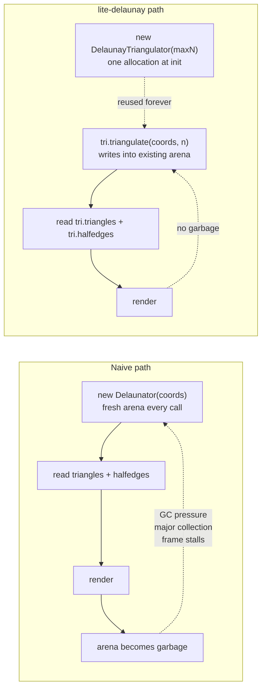
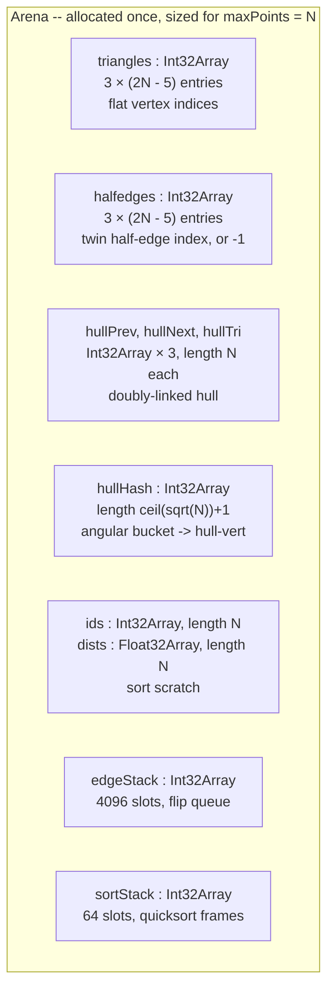
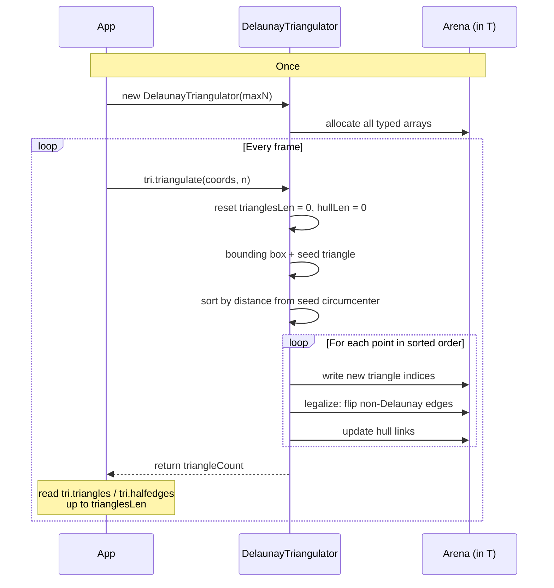
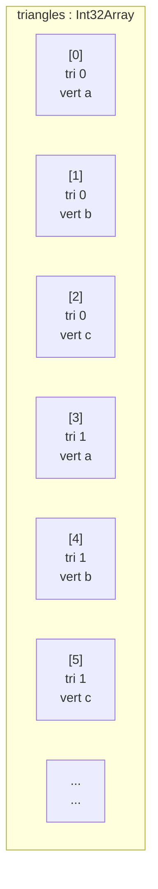

# @zakkster/lite-delaunay

[](https://www.npmjs.com/package/@zakkster/lite-delaunay)

[](https://bundlephobia.com/result?p=@zakkster/lite-delaunay)
[](https://www.npmjs.com/package/@zakkster/lite-delaunay)
[](https://www.npmjs.com/package/@zakkster/lite-delaunay)


[](https://opensource.org/licenses/MIT)

**Pre-allocated, zero-GC 2D Delaunay triangulation for per-frame use in games, simulations, and interactive graphics.**

One allocation for the lifetime of the triangulator. No `new Delaunator(coords)` per frame. No object graphs. No garbage-collection pauses when your point set moves.

```js
import { DelaunayTriangulator } from '@zakkster/lite-delaunay';

// Construct once -- sized for the largest input you'll ever pass.
const tri = new DelaunayTriangulator(10_000);

// Per frame:
const count = tri.triangulate(coords, n);     // zero allocations
for (let k = 0; k < count; k++) {
  const a = tri.triangles[k * 3];
  const b = tri.triangles[k * 3 + 1];
  const c = tri.triangles[k * 3 + 2];
  // ... emit triangle (a, b, c) ...
}
```

Same sweepline algorithm as [Mapbox Delaunator](https://github.com/mapbox/delaunator). Same Delaunay-property guarantees. Same half-edge mesh output. The only difference is that the typed arrays live in the triangulator object instead of being created on every call.

---

## Contents

- [Why](#why) | [Install](#install) | [Quick start](#quick-start)
- [How it works](#how-it-works)
- [Reading the output](#reading-the-output)
- [Use case: Voronoi from the dual graph](#use-case-voronoi-from-the-dual-graph)
- [Spatial index: hit-testing dense point clouds](#spatial-index-hit-testing-dense-point-clouds)
- [API reference](#api-reference)
- [Benchmarks](#benchmarks)
- [Testing](#testing)
- [Browser & engine compatibility](#browser--engine-compatibility)
- [Edge cases & guarantees](#edge-cases--guarantees)
- [FAQ](#faq) | [License](#license)

---

## Why

Delaunay triangulation comes up the moment you want to do anything mesh-shaped from a 2D point set: adaptive terrain LOD, low-poly procedural art, Voronoi cells, nearest-neighbor lookups, alpha-shape hulls, marching-squares isolines on irregular grids. The math is well-known and the existing JS libraries (`delaunator`, `d3-delaunay`) implement it well -- but they're written for one-shot use:

```js
// The code you write first, and regret later
function renderFrame(points) {
  const d = new Delaunator(points);              // <- allocates fresh arena
  for (let i = 0; i < d.triangles.length; i += 3) {
    // ... draw triangle ...
  }
}
```

For ~50 KB of typed-array allocation per call, at 60 fps that's ~3 MB/s of garbage. The young-generation GC keeps up -- until the moment a major collection fires mid-frame and you drop a frame. On low-end devices and battery-powered scenarios the cost is felt much sooner.



`@zakkster/lite-delaunay` owns the pre-allocated `Int32Array` arena and reuses it forever. The hot loop stays a plain indexed-store loop. The algorithm is the same as the reference. That's the point.

### What this is *not*

- **Not a new algorithm.** It's the Mapbox Delaunator sweepline algorithm, ported to a static arena. If the reference produces a particular triangulation for an input, so does this -- modulo floating-point determinism.
- **Not a Voronoi library.** It produces the Delaunay triangulation and its half-edge mesh. Voronoi cells are the dual graph -- easy to extract (see [the example below](#use-case-voronoi-from-the-dual-graph)) but you have to write that step.
- **Not robust against ill-conditioned inputs.** Like the reference, it uses fast non-robust `f64` predicates. Inputs with extreme coordinate range or near-cocircular degeneracies can produce slightly different outputs vs `robust-predicates`. For ~99% of practical use this is invisible.

---

## Install

```bash
npm i @zakkster/lite-delaunay
```

ESM-only. No dependencies. Ships TypeScript definitions alongside the source.

```js
import { DelaunayTriangulator } from '@zakkster/lite-delaunay';
```

You can also drop `Delaunay.js` into your project directly -- it's one file, ~500 lines.

---

## Quick start

```js
import { DelaunayTriangulator } from '@zakkster/lite-delaunay';

// 1. Allocate once. Pick the largest point count you'll ever pass.
//    ~700 KB of typed arrays for maxPoints = 10_000.
const tri = new DelaunayTriangulator(10_000);

// 2. Provide coordinates as flat interleaved [x, y, x, y, ...]
const coords = new Float32Array([
  0,   0,
  100, 0,
  100, 100,
  0,   100,
]);

// 3. Triangulate. Returns the number of triangles produced.
const count = tri.triangulate(coords, 4);   // -> 2

// 4. Iterate. triangles[3k..3k+2] are the three vertex indices of triangle k.
for (let k = 0; k < count; k++) {
  const a = tri.triangles[k * 3];
  const b = tri.triangles[k * 3 + 1];
  const c = tri.triangles[k * 3 + 2];

  const ax = coords[a * 2], ay = coords[a * 2 + 1];
  const bx = coords[b * 2], by = coords[b * 2 + 1];
  const cx = coords[c * 2], cy = coords[c * 2 + 1];

  ctx.beginPath();
  ctx.moveTo(ax, ay);
  ctx.lineTo(bx, by);
  ctx.lineTo(cx, cy);
  ctx.closePath();
  ctx.stroke();
}
```

That's the whole API surface. The interesting thing -- the half-edge mesh -- comes next.

---

## How it works

### The algorithm in one paragraph

Sweepline Delaunay (Liu/Snoeyink 2005, popularised in JS by Mapbox's Delaunator): pick three points near the centroid as a seed triangle; sort the remaining points by distance from that triangle's circumcircle; and add them one at a time, each one creating a fan of triangles against the current hull edges visible from it, then "legalising" each new edge by flipping it if the Delaunay in-circle predicate fails. The hull is maintained as a doubly-linked list with an angular hash for O(1) average lookup. Total work: O(n log n) expected, O(n^2) worst-case on adversarial cocircular inputs.

### What's in the arena



For `maxPoints = N`, total memory is approximately **68N + 16 KB**. At N = 10 000 that's ~700 KB. At N = 100 000 it's ~7 MB. Picking a tighter bound for `maxPoints` directly saves memory; the algorithm has no hidden growth elsewhere.

### What happens in `triangulate(coords, n)`



The `triangulate` method does no `new` anywhere on the success path. Errors (precondition failures) do construct an `Error` -- by definition off the hot path.

---

## Reading the output

After `tri.triangulate(coords, n)` returns `triCount`, two arrays are valid up to index `tri.trianglesLen` (which is exactly `triCount * 3`):

### `triangles` -- vertex indices, three per triangle



Triangle `k`'s vertices are `triangles[3*k]`, `triangles[3*k + 1]`, `triangles[3*k + 2]`. Each is an index into your original `coords` array -- so the (x, y) of vertex `a` is `(coords[a*2], coords[a*2+1])`. Winding is **counter-clockwise in math coordinates** (in screen-space with Y pointing down, this looks clockwise).

### `halfedges` -- neighbour links, the same shape

`halfedges[i]` is the index (in this same flat indexing) of the opposite half-edge across the shared edge, or **`-1` if the edge is on the convex hull**. This is the standard half-edge mesh representation. It lets you walk the dual graph (for Voronoi), find triangle neighbours, or traverse the hull, all in O(1) per step.

The rules:

- Half-edge `i` belongs to triangle `Math.floor(i / 3)`.
- Going from `i` to the *next* half-edge in the same triangle: `i % 3 === 2 ? i - 2 : i + 1`.
- Going from `i` to the *previous* half-edge: `i % 3 === 0 ? i + 2 : i - 1`.
- The two endpoint vertices of half-edge `i` are `triangles[i]` and `triangles[nextHalfedge(i)]`.

So finding neighbour triangles is trivial:

```js
const neighbour = tri.halfedges[i];                   // -1 if hull
if (neighbour !== -1) {
  const neighbourTriangle = Math.floor(neighbour / 3);
}
```

Walking the convex hull is a two-step pattern: find any hull half-edge (`halfedges[i] === -1`), then walk by following `next` and jumping across when needed. This is identical to Mapbox Delaunator and there are existing tutorials and reference code for it.

---

## Use case: Voronoi from the dual graph

Delaunay's dual is Voronoi. Once you have the half-edge mesh, the Voronoi cell of a point is the polygon formed by connecting the circumcenters of the triangles around it. This is the canonical "where am I closest to?" data structure for moving point sets -- and it's exactly the use case lite-delaunay was built for.

```js
const tri = new DelaunayTriangulator(maxPoints);

// One-time scratch buffers -- also zero-GC.
const circumX = new Float32Array(tri.maxTriangles);
const circumY = new Float32Array(tri.maxTriangles);

function circumcenter(ax, ay, bx, by, cx, cy, out, k) {
  const dx = bx - ax, dy = by - ay;
  const ex = cx - ax, ey = cy - ay;
  const bl = dx * dx + dy * dy;
  const cl = ex * ex + ey * ey;
  const d  = 0.5 / (dx * ey - dy * ex);
  out[k]     = ax + (ey * bl - dy * cl) * d;
  out[k + 1] = ay + (dx * cl - ex * bl) * d;
}

function renderFrame(coords, n) {
  const triCount = tri.triangulate(coords, n);

  // Per-triangle circumcenter pass -- one shot, no allocation.
  for (let k = 0; k < triCount; k++) {
    const a = tri.triangles[k * 3];
    const b = tri.triangles[k * 3 + 1];
    const c = tri.triangles[k * 3 + 2];
    circumcenter(
      coords[a*2], coords[a*2+1],
      coords[b*2], coords[b*2+1],
      coords[c*2], coords[c*2+1],
      circumX, k
    );
    // ... and circumY[k] similarly ...
  }

  // To draw the Voronoi cell of point p, walk the half-edges around p and
  // connect circumcenters of the triangles you visit.
  // (Implementation: ~30 lines, identical to d3-delaunay's voronoi.js)
}
```

The key point: this entire pipeline is **per-frame** with **zero allocations**. For a 1000-point moving system at 60 fps, that's the difference between smooth and stuttery on mid-range hardware.

---

## Spatial index: hit-testing dense point clouds

**New in 1.1.0.** The triangulator is a mesh kernel; `createSpatialIndex` is the *charts-facing* capability built on top of the same zero-GC discipline. It answers one question fast, allocation-free, on a moving cursor: **which points are nearest to (x, y)?**

This is exactly the interface `@zakkster/lite-charts` injects to hit-test dense bubble/scatter series. The chart owns the interface; lite-delaunay ships an implementation you wire in with one line:

```js
import { createSpatialIndex } from '@zakkster/lite-delaunay';

const chart = createBubbleChart({
  // One factory for the whole chart. It builds one index per series and
  // disposes them independently as data changes. maxPoints >= your largest
  // series point count.
  spatialIndexFactory: createSpatialIndex(20_000),
  // ...
});
```

That is the entire wire-up. Under the hood the factory is `(pxs, pys, n) -> SpatialIndex`:

```js
const factory = createSpatialIndex(20_000);

// Rebuild on data change (charts do this at extract time). SoA pixel
// coordinates in, an allocation-free handle out.
const index = factory(pxs, pys, n);

// Caller owns the output buffers; sized once, reused across queries.
const outIndices = new Int32Array(8);
const outDistSq  = new Float32Array(8);

// Per hover: up to k nearest by pixel distance, within maxDistSq.
const k = index.findNearest(cursorX, cursorY, 8, maxRadiusSq, outIndices, outDistSq);
for (let j = 0; j < k; j++) {
  const pointIndex = outIndices[j];   // ORIGINAL index into pxs/pys
  const distSq     = outDistSq[j];    // SQUARED pixel distance, nearest-first
  // ... post-filter by disc containment: distSq <= r*r ...
}

// When the data changes, dispose before rebuilding.
index.dispose();
```

`k > 1` matters for overlapping discs: the point whose *center* is nearest may not be the one whose *disc* contains the cursor. The index returns the k nearest by center distance; the chart post-filters by containment and smallest-radius tie-break, preserving the linear-scan visual semantics exactly.

### Why a uniform grid, not the mesh walk

For pure radius-bounded k-NN a uniform grid is simpler and, on the clustered pixel inputs a chart actually issues, at least as fast as a Delaunay point-location walk. So 1.1.0 ships the grid inside `createSpatialIndex`; the mesh walk is deferred to a later release (it earns its keep once the mesh is also the substrate for Voronoi cells and scattered-data interpolation). The exported contract is identical either way, so this is a swap you never see. `triangulate()` is **not** called by the spatial index.

### Contract

| Member | Signature | Notes |
|---|---|---|
| `createSpatialIndex` | `(maxPoints) -> SpatialIndexFactory` | Throws if `maxPoints` is not a non-negative integer. |
| factory | `(pxs, pys, n) -> SpatialIndex` | Throws if `n > maxPoints`, `n` is not a non-negative integer, `pxs`/`pys` are missing, or shorter than `n`. |
| `findNearest` | `(qx, qy, k, maxDistSq, outIndices, outDistSq) -> count` | Writes ORIGINAL indices + SQUARED distances, nearest-first, filtered to `d <= maxDistSq` (inclusive). Returns `0..k`. `k` clamped to 8. |
| `dispose` | `() -> void` | Returns the handle to the factory pool. Using or double-disposing a disposed handle throws. |

### Degenerate and NaN semantics (fail closed)

- **NaN / Infinity points are never returned.** `pxs`/`pys` legitimately carry `NaN` (log-scale projections, missing data); the build compacts only finite points, so a hole can never surface as a hit.
- **A non-finite query returns `0`.** `NaN`/`Infinity` for `qx` or `qy` fails closed -- never a guess.
- **All-coincident or all-collinear input still answers correctly.** The grid degrades to a small-cell / linear scan for degenerate density -- never wrong, maybe slow.

### Zero-GC design, including the pool

- **`findNearest` allocates nothing.** It inserts into the caller-owned output arrays (insertion sort, `k <= 8`) plus a slot-owned f64 scratch; no closures, no temporaries.
- **A rebuild allocates exactly one small handle facade (~48 B).** The factory holds a slot **pool**; all arenas, grids and scratch are pooled, so a build is 0 B *beyond that facade*. One factory serves many concurrent live handles (a multi-series chart builds one per series and disposes them independently). A build acquires a free slot; a dispose returns it. A brand-new slot is allocated only when concurrency reaches a new high-water mark. The facade is young-gen and minor-GC-collectible -- it never causes a major collection (the torture gate proves 2000 rebuild cycles cause zero major GC). This is *not* 0 B/rebuild, and the docs never claim it is.
- **Fail-closed handles.** The facade carries a generation stamp over its pooled slot: a disposed handle throws on use, double-dispose throws, and a *stale* handle whose slot was rebuilt for another series throws rather than silently returning the new build's points. (With object-reused handles a stale reference is byte-indistinguishable from a fresh one, so fail-closed law forces the fresh facade per build -- the price is one ~48 B object, never a wrong answer.)
- **Per-slot memory** is approximately `24 * maxPoints` bytes plus the grid-cell arrays (`~ maxPoints` cells). Peak scales with the concurrent high-water mark of live handles, not the number of rebuilds.

The `node --expose-gc test/torture.mjs` gate proves all of this: 0 major GCs across ~200k stepped queries, `tracker.size()` back to 0 after 4096 build/dispose cycles, and a rebuild-churn subphase whose heap growth (after the facades are collected) stays in the noise floor.

---

## API reference

### `new DelaunayTriangulator(maxPoints)`

| Arg | Type | Description |
|---|---|---|
| `maxPoints` | `number` | Hard upper bound on input size. Must be a non-negative integer. Sets the size of the internal arena -- pick the largest you'll ever pass to `triangulate()`. |

**Throws** if `maxPoints` is negative, non-integer, or `NaN`.

### Instance properties

| Member | Type | Description |
|---|---|---|
| `maxPoints` | `number` | As passed. |
| `maxTriangles` | `number` | `max(2 × maxPoints - 5, 0)` -- Euler's upper bound. |
| `hashSize` | `number` | Internal hash table size. Diagnostic only. |
| `triangles` | `Int32Array` | Length `maxTriangles × 3`. Valid up to `trianglesLen`. |
| `halfedges` | `Int32Array` | Length `maxTriangles × 3`. Valid up to `trianglesLen`. `-1` denotes a convex-hull edge. |
| `trianglesLen` | `number` | Number of *valid* entries in `triangles` and `halfedges`. Equals `triangleCount × 3`. Reset on every `triangulate()` call. |

### `triangulate(coords, pointCount) -> number`

| Arg | Type | Description |
|---|---|---|
| `coords` | `Float32Array \| Float64Array \| number[]` | Flat interleaved `[x0, y0, x1, y1, ...]`. Must hold at least `pointCount * 2` elements. |
| `pointCount` | `number` | Number of logical points. Must be <= `maxPoints`. |

**Returns** the number of triangles generated. Read vertex indices from `triangles[0 .. returnValue * 3 - 1]`, half-edge twins from `halfedges[0 .. returnValue * 3 - 1]`.

**Throws** if `pointCount > maxPoints`.

**Does not throw** on degenerate input (returns 0 instead):

- `pointCount < 3`
- all input points coincident
- all input points collinear (no 2D triangulation exists)

State from a previous call is fully reset, including `trianglesLen`. So a degenerate call after a successful one does not leak ghost triangles.

---

## Benchmarks

### vs Mapbox Delaunator

Same algorithm, very similar throughput. Median of 8 runs on Node 22, Apple-Silicon-class hardware:

| n | lite-delaunay (ms) | Delaunator (ms) | Speed ratio | Delaunator heap delta |
|---:|---:|---:|---:|---:|
| 100 | 0.033 | 0.047 | **1.42×** | 90 KB |
| 1 000 | 0.55 | 0.54 | 0.98× | 50 KB |
| 5 000 | 3.16 | 3.30 | 1.04× | 1 KB |
| 10 000 | 6.82 | 7.04 | 1.03× | 0 KB |
| 50 000 | 39.7 | 44.0 | 1.11× | 0 KB |
| 100 000 | 86.8 | 93.6 | 1.08× | 17 KB |

Honest reading:

- **At small N** lite-delaunay is meaningfully faster because Delaunator allocates output arrays on every call -- a real cost when the work itself is microseconds.
- **At typical interactive sizes (1k-10k)** the two are at parity. The algorithm dominates and both implementations do the same work.
- **At very large N (50k+)** lite-delaunay is consistently ~5-10% ahead -- the pseudo-angle hash and arena layout amortize favourably.

The pitch is still **"never allocates"** -- lite-delaunay's heap delta is <= 0.5 KB across the entire table, including 10 000 repeated calls. Throughput parity is a bonus, not the headline. If you triangulate once per page load, either library is fine. If you triangulate every frame, allocation cost shows up as GC pauses and lite-delaunay's per-call heap delta of zero matters more than the millisecond difference.

Numbers will vary by hardware; run `npm run bench:compare` on your target machine for honest local readings.

### Frame-budget rule of thumb

At 60 fps you have **16.67 ms per frame**. From the table above:

- **<= 1 000 points** -- ~0.5 ms (3% of budget) -- comfortable for 120fps
- **<= 5 000 points** -- ~3 ms (18% of budget) -- fits per-frame at 60fps
- **<= 10 000 points** -- ~7 ms (42% of budget) -- works at 60fps if it's most of your CPU work
- **> 25 000 points** -- one-shot territory

### Zero-allocation guarantee

The test suite asserts heap delta stays under 1 MB across 10 000 `triangulate()` calls (with `--expose-gc`). The hot path does no `new`; the only object construction in the whole API is the precondition `Error`, which never fires on a correctly-used call.

Run it yourself:

```bash
git clone https://github.com/PeshoVurtoleta/lite-delaunay && cd lite-delaunay
npm install --save-dev delaunator      # for the vs-reference bench
node --expose-gc bench/bench.js
node --expose-gc bench/bench-vs-delaunator.js
```

---

## Testing

```bash
npm test
# or: node --expose-gc test/edge-cases.test.js
```

A clean run prints **35 passed, 0 failed** and exits 0. The suite is organised into eight sections:

| Section | What's covered |
|---|---|
| 1. Correctness | Random inputs from 3 to 10 000 points. Every output verified against the in-circle Delaunay predicate; every halfedge checked for reciprocal pairing; every triangle-vertex index checked in range. |
| 2. Degenerate inputs | 0/1/2 points, all-coincident, fully-collinear (H/V/diagonal), near-duplicate points within machine epsilon. All return 0 cleanly; none hang. |
| 3. State & reuse | Large-then-small calls reset state correctly. Idempotent across re-runs. Using less than `maxPoints` works without padding. |
| 4. Constructor validation | Negative, non-integer, `NaN` `maxPoints` throw with a clear message. |
| 5. Input type compatibility | `Float32Array`, `Float64Array`, plain `number[]` all produce identical output. |
| 6. Known-tricky geometry | 8×8 cocircular grid (every cell is a Delaunay-degenerate quad), Archimedean spiral (sweepline stress pattern), points on a circle (fan triangulation), two distant clusters (long hull edges). |
| 7. Topology invariants | Euler's formula (3F = 2E_interior + E_hull). Counter-clockwise winding in math coordinates. |
| 8. Zero-allocation | 10 000 `triangulate()` calls grow heap by < 1 MB (< 1 KB with forced GC). |

If any test fails, exit code is 1 and the failing assertion is printed with the file/line. Suitable for CI.

---

## Browser & engine compatibility

The library is plain ESM and uses only standard `Int32Array` / `Float32Array` APIs, so it works everywhere ES2020+ works.

| Target | Status |
|---|---|
| Chrome / Edge 80+ | yes |
| Firefox 75+ | yes |
| Safari 14+ (iOS 14+) | yes |
| Node.js 18+ | yes |
| Bun / Deno | yes |
| Web Workers | yes -- typed arrays are `Transferable` |

---

## Edge cases & guarantees

Behaviours the test suite pins down:

- **The hot path is allocation-free.** No `new`, no `[...]`, no object literals. Only typed-array indexed reads and writes.
- **Degenerate inputs return 0; they do not throw or hang.** Coincident points, collinear points, and < 3 points all yield an empty triangulation with `trianglesLen = 0`. Detect them by checking the return value.
- **State is reset on every call**, *including* degenerate ones. A degenerate call after a successful one will not leak stale triangles into the next reader.
- **Output triangles use counter-clockwise winding in math coordinates** (Y-up, math convention). In screen-space (Y-down) this reads as clockwise. Same convention as Mapbox Delaunator.
- **Half-edges form a closed mesh.** For every `e` with `halfedges[e] !== -1`, `halfedges[halfedges[e]] === e`. Hull edges have `halfedges[e] === -1`.
- **The vertex set is preserved.** Triangle indices reference the same point indices you passed in -- no deduplication, no reordering, no fresh point IDs.
- **Numerical behaviour matches Mapbox Delaunator.** Same `f64` predicates, same EPSILON for near-duplicate skip, same seed-triangle selection. Outputs may differ from `robust-predicates`-based libraries on near-cocircular inputs.
- **Hard cap on point count.** `triangulate(coords, n)` throws if `n > maxPoints`. There is no auto-grow -- that would defeat the zero-allocation contract.

---

## FAQ

**Why a hard `maxPoints` cap? Why not auto-grow?**
Auto-growing would re-allocate the arena, invalidating every reference into it. The whole point is that those allocations don't happen. Pick a number large enough for your worst frame; you pay ~68N bytes once.

**How big should `maxPoints` be?**
Whatever your worst-case point count is, plus a little headroom. For a moving 1000-point system, `maxPoints = 2000` is plenty. The memory cost is cheap (~135 KB for 2000 points).

**Can I reuse one triangulator across multiple unrelated inputs?**
Yes -- that's the canonical pattern. Each call fully resets state. You can even change the meaning of point indices between calls.

**Why use this over `delaunator` / `d3-delaunay`?**
Use `d3-delaunay` if you need its rich Voronoi/path-generation API and don't call it per-frame. Use `delaunator` if you call it once at setup. Use this if you call it every frame and care about GC stutter.

**Does it produce the same output as the reference?**
Yes for non-degenerate inputs (modulo floating-point determinism, which both libraries share). The correctness test suite verifies the output against the canonical in-circle Delaunay predicate -- not against the reference's exact triangle ordering, since that's an implementation detail.

**What about the Voronoi diagram?**
The Voronoi cells are the dual graph: connect the circumcenters of the triangles around each point. Once you have the half-edge mesh from `triangulate()`, building Voronoi cells is ~30 lines of code (see the [use case section](#use-case-voronoi-from-the-dual-graph)). I'll likely ship `@zakkster/lite-voronoi` as a thin layer on top of this; until then, look at `d3-delaunay`'s `voronoi.js` for a reference implementation.

**Is the algorithm numerically robust?**
No, and neither is Delaunator. Both use non-robust `f64` predicates, which is fine for typical inputs but can produce slightly wrong outputs on near-cocircular degeneracies. If you need certified-robust predicates, use `d3-delaunay` with `@mourner/robust-predicates` -- at significant performance cost.

**Does it work in a Web Worker?**
Yes. `Int32Array` and `Float32Array` are `Transferable`. You can build the triangulation in a worker and `postMessage` the `triangles` buffer back. Note that transferring detaches the buffer from the original instance -- for two-way zero-copy use `SharedArrayBuffer` (which needs cross-origin isolation headers).

**What about indexed rendering / line segments / convex hull?**
The half-edge mesh gives you all of these. Triangle indices for `gl.drawElements(GL_TRIANGLES, ...)` are exactly `tri.triangles`. Hull traversal is a standard half-edge walk over the `-1` edges.

---

## License

MIT (c) [Zahary Shinikchiev](https://github.com/PeshoVurtoleta)
